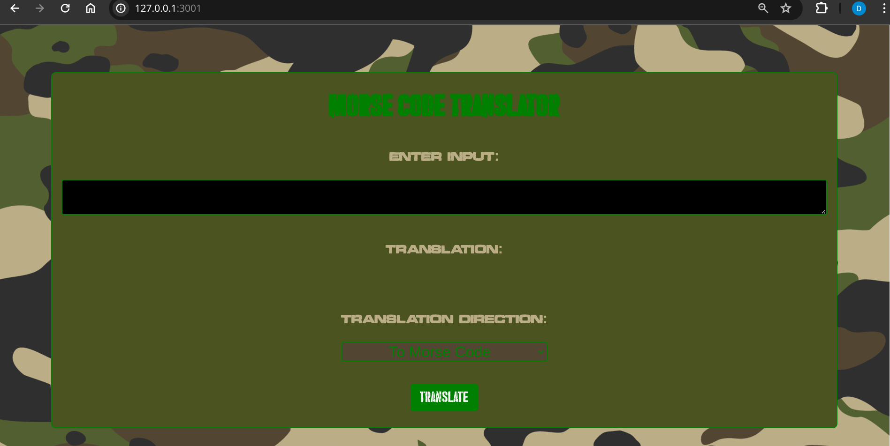
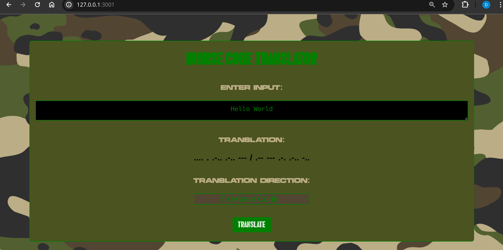
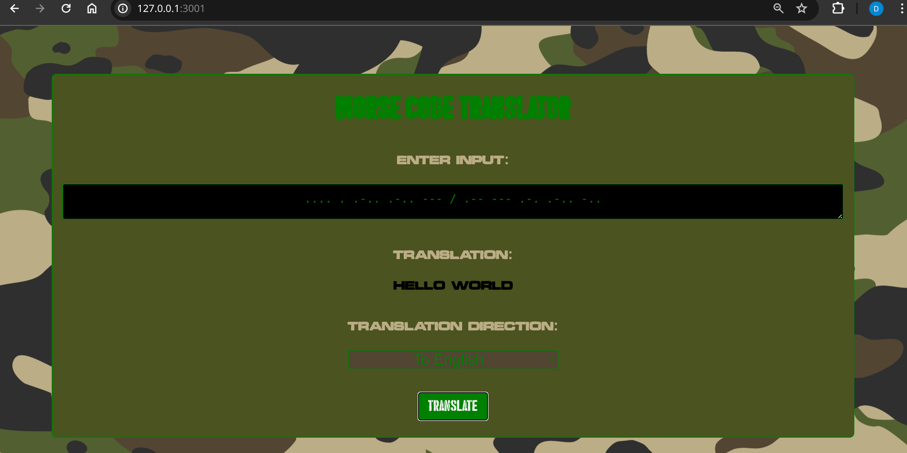

# Morse Code Translator
The Morse Code Translator can translate Morse Code to English and vice versa.

It is built with HTMl, CSS and JavaScript.

# Instructions

* Click here to visit the app: <a href="https://davejamieson.github.io/morseCodeTranslator/" >Morse Code Translator</a> 

* Enter the English Characters or Morse Code to be translated into the input field
* Select the desired output via the dropdown menu
* Hit the TRANSLATE button!! 





## Available Characters

  * Letters
  'A': '.-', 'B': '-...', 'C': '-.-.', 'D': '-..', 'E': '.', 'F': '..-.', 'G': '--.', 'H': '....', 'I': '..', 'J': '.---', 'K': '-.-', 'L': '.-..', 'M': '--', 'N': '-.', 'O': '---', 'P': '.--.', 'Q': '--.-', 'R': '.-.', 'S': '...', 'T': '-', 'U': '..-', 'V': '...-', 'W': '.--', 'X': '-..-',
  'Y': '-.--', 'Z': '--..',
  * Numbers
  '1': '.----', '2': '..---', '3': '...--', '4': '....-', '5': '.....', '6': '-....', '7': '--...', '8': '---..', '9': '----.', '0': '-----',
  * Symbols
  '?': '..--..', '!': '-.-.--', ',': '--..--', '.': '.-.-.-', ';': '-.-.-.', ':': '---...', '+': '.-.-.', '-': '-....-', '/': '-..-.', '=': '-...-', '(': '-.--.', ')': '-.--.-', '&': '.-...', '_': '..--.-', '"': '.-..-.', '$': '...-..-', '@': '.--.-.', '\n': '/'

## Test-Driven Development (TDD) and Unit Testing

This project uses Jest for unit testing to ensure the correctness of the Morse Code translation functions. TDD principles were followed during the development of this project, meaning tests were written before the actual code to define the desired functionality.

### Running Tests

To run the tests, use the following command in the project directory:

In the project directory, you can run:

### `npm test`

Launches the test runner in the interactive watch mode.\
See the section about [running tests](https://facebook.github.io/create-react-app/docs/running-tests) for more information.

## Testing Strategy

1. **Unit Tests**: Each function in the `functions.js` file is tested individually to ensure it handles all expected input cases correctly.
2. **Edge Cases**: Tests cover various edge cases, such as empty input, invalid characters, and boundary values.
3. **Integration Tests**: Ensures that the translation from English to Morse Code and vice versa works correctly when the functions are used together.

### Example Tests

Below are examples of unit tests written for the translation functions:

```javascript

// 5. it should translate hello world to .... . .-.. .-.. --- / .-- --- .-. .-.. -..
  it( ' should translate "HELLO WORLD" to ".... . .-.. .-.. --- / .-- --- .-. .-.. -.." ', () =>
  {
    const result = convertToMorse( 'HELLO WORLD' );
    expect( result ).toBe( '.... . .-.. .-.. --- / .-- --- .-. .-.. -..' );
  } )

  // 6. it should translate bond 007 to -... --- -. -.. / ----- ----- --... 
  it( ' should translate "BOND 007" to "-... --- -. -.. / ----- ----- --..." ', () =>
  {
    const result = convertToMorse( 'BOND 007' );
    expect( result ).toBe( '-... --- -. -.. / ----- ----- --...' );
  } )


 // 8. it should display an error message if a character is not convertable
  it( ' should display an error message if a character is not convertable ', () =>
  {
    const result = convertToEnglish( '*' );
    expect( result ).toBe( 'Only Enter Convertible Characters' );
  } )

  // 9. it should display an error message if user input is an empty string, null or undefined
  it( ' it should display an error message if user input is an empty string, null or undefined ', () =>
  {
    const result = convertToEnglish( '' );
    expect( result ).toBe( 'Please Enter An Input Value' );
  } )
```
